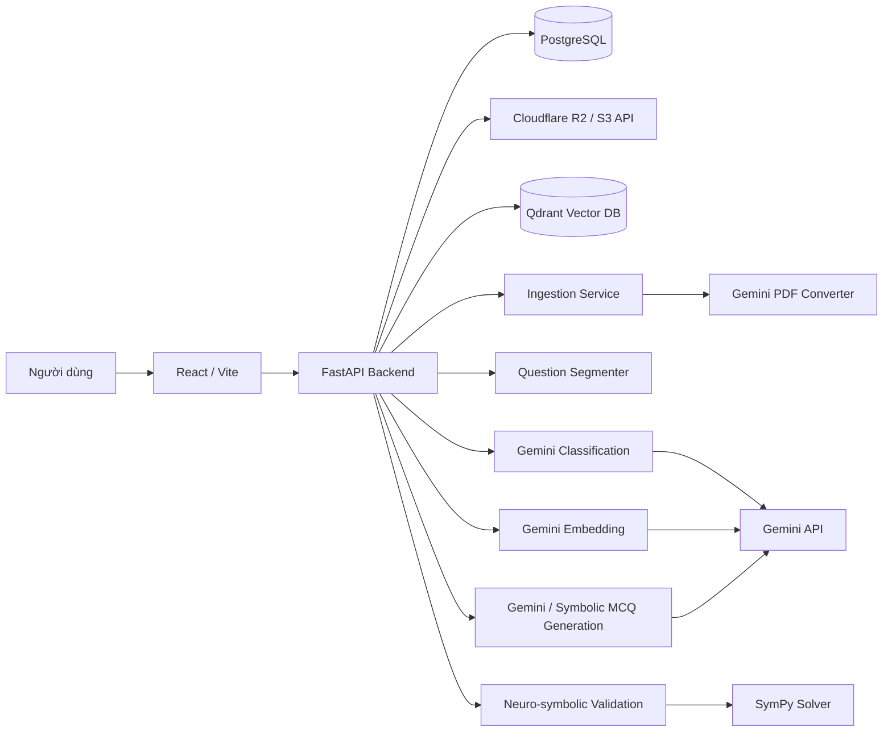
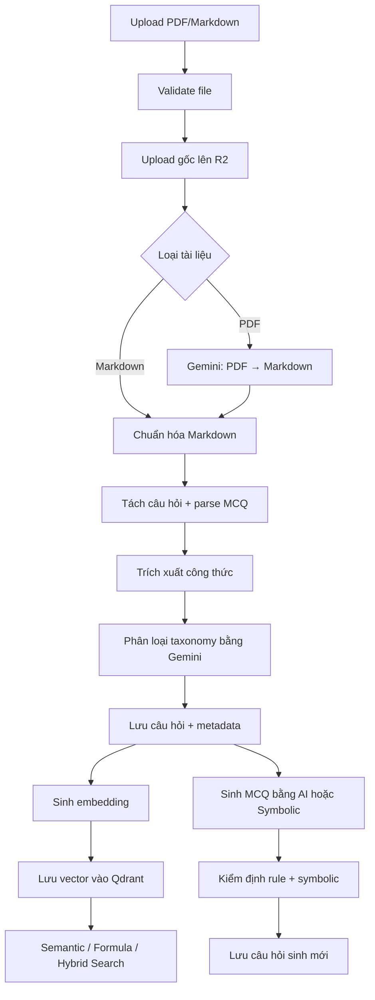

# Math Matching AI

**Hệ thống ngân hàng câu hỏi Toán học tích hợp AI** — tự động hóa toàn bộ pipeline từ ingest tài liệu, tách câu hỏi, phân loại theo taxonomy, sinh embedding, tìm kiếm ngữ nghĩa, sinh câu hỏi trắc nghiệm cho đến kiểm định chất lượng bằng phương pháp **neuro-symbolic** (kết hợp LLM với symbolic solver SymPy).

```text
Backend:  FastAPI · PostgreSQL · Qdrant · SQLAlchemy Async
Frontend: React 19 · Vite · Tailwind CSS · KaTeX
AI/ML:    Google Gemini (PDF→Markdown, classification, generation, embedding) · SymPy
Infra:    Docker · Docker Compose · Nginx · Cloudflare R2
```

---

## Mục lục

- [Giới thiệu](#giới-thiệu)
- [Tính năng chính](#tính-năng-chính)
- [Kiến trúc hệ thống](#kiến-trúc-hệ-thống)
- [Luồng xử lý AI](#luồng-xử-lý-ai)
- [Công nghệ sử dụng](#công-nghệ-sử-dụng)
- [Cấu trúc thư mục](#cấu-trúc-thư-mục)
- [Yêu cầu hệ thống](#yêu-cầu-hệ-thống)
- [Cài đặt](#cài-đặt)
- [Biến môi trường](#biến-môi-trường)
- [Khởi chạy dự án](#khởi-chạy-dự-án)
- [Hướng dẫn sử dụng](#hướng-dẫn-sử-dụng)
- [API Documentation](#api-documentation)
- [Ví dụ đầu vào / đầu ra](#ví-dụ-đầu-vào--đầu-ra)
- [Kiểm thử](#kiểm-thử)
- [Đánh giá chất lượng MCQ](#đánh-giá-chất-lượng-mcq)
- [Bảo mật](#bảo-mật)
- [Hạn chế hiện tại](#hạn-chế-hiện-tại)
- [Hướng phát triển](#hướng-phát-triển)
- [Đóng góp](#đóng-góp)
- [Tác giả & liên hệ](#tác-giả--liên-hệ)

---

## Giới thiệu

**Math Matching AI** giải quyết bài toán xây dựng và khai thác ngân hàng câu hỏi Toán học (trọng tâm Giải tích 1) từ tài liệu đầu vào dạng PDF hoặc Markdown. Hệ thống chuyển đổi tài liệu, tách câu hỏi, trích xuất công thức, phân loại theo taxonomy, sinh vector embedding và hỗ trợ tìm kiếm câu hỏi tương tự theo nội dung hoặc công thức.

Điểm khác biệt của hệ thống là cách kết hợp hai cách tiếp cận:

- **LLM (Gemini)** — xử lý các tác vụ cần hiểu ngôn ngữ tự nhiên: chuyển PDF sang Markdown, phân loại taxonomy, sinh câu hỏi trắc nghiệm, sinh embedding.
- **Symbolic (SymPy)** — xác minh tính đúng đắn của đáp án bằng solver registry cho các dạng bài có thể biểu diễn toán học, giảm rủi ro "hallucination" của LLM khi sinh câu hỏi mới.

Đối tượng sử dụng chính: giảng viên, người xây dựng đề thi, hoặc nhà phát triển cần một ngân hàng câu hỏi có khả năng tìm kiếm ngữ nghĩa và sinh biến thể tự động có kiểm định.

## Tính năng chính

### Xử lý tài liệu
- Upload PDF, Markdown (`.md`, `.markdown`), giới hạn dung lượng theo `MAX_UPLOAD_SIZE_MB`.
- Lưu file gốc lên Cloudflare R2 (S3-compatible), metadata vào PostgreSQL.
- Chuyển PDF → Markdown bằng Gemini, chuẩn hóa nội dung sau ingest.

### Tách & lưu câu hỏi
- Tách câu hỏi dựa trên pattern marker; tách đề bài, lời giải, đáp án.
- Phát hiện tự động câu hỏi trắc nghiệm có lựa chọn A/B/C/D.
- Trích xuất công thức LaTeX từ đề bài, lời giải, đáp án và các lựa chọn.

### Phân loại taxonomy
- Phân loại theo taxonomy Giải tích 1 (`core/taxonomy/calculus_1_taxonomy.json`) bằng Gemini classifier.
- Lưu `chapter_code`, `topic_code`, `problem_type_code`, confidence, reasoning và model đã dùng.
- Kiểm tra chất lượng taxonomy: mã thiếu, sai quan hệ cha–con, confidence thấp, skill ngoài vocabulary.

### Embedding & tìm kiếm
- Sinh embedding bằng `gemini-embedding-2`, lưu vector vào Qdrant.
- Tìm kiếm ngữ nghĩa theo nội dung câu hỏi và tìm kiếm công thức theo LaTeX đã chuẩn hóa.
- Hybrid scoring: kết hợp semantic, taxonomy, formula, difficulty và skill score.
- Filter theo subject, chapter, loại câu hỏi, taxonomy code, độ khó, skill.

### Sinh & kiểm định câu hỏi trắc nghiệm
- Sinh MCQ bằng AI từ câu hỏi nguồn, hoặc chuyển câu hỏi tự luận sang trắc nghiệm.
- Sinh MCQ bằng symbolic solver theo từng dạng bài Giải tích 1.
- Kiểm định cấu trúc (đủ 4 lựa chọn, đúng 1 đáp án, không trùng key), kiểm định distractor (không trùng đáp án đúng, không quá giống nhau) và kiểm định symbolic khi có solver phù hợp.
- Trả về `validation_report`, `warnings`, `blocking_issues`, `symbolic_checks` trước khi lưu vào ngân hàng câu hỏi.

### Dashboard & Analytics
- Thống kê tài liệu theo trạng thái xử lý.
- Thống kê câu hỏi theo embedding, công thức, độ khó, chương, chủ đề.
- Theo dõi tỷ lệ MCQ hợp lệ, lỗi đáp án, lỗi distractor, solver không khả dụng và câu hỏi cần review.

## Kiến trúc hệ thống



## Luồng xử lý AI



**Phân nhóm xử lý:**

| Nhóm | Thành phần |
| --- | --- |
| Rule-based | Validate upload, segment pattern, MCQ parser A/B/C/D, quality rules, duplicate rules |
| LLM | Gemini PDF conversion, classification, MCQ generation, free-response → MCQ |
| Semantic embedding | `QuestionEmbeddingService`, `GeminiEmbedder`, Qdrant repository, hybrid search |
| Symbolic | `modules/neuro_symbolic`: solver registry, executor, distractor service, validator |
| Hậu xử lý | Normalize Markdown/formula, validation report, review status, analytics |

## Công nghệ sử dụng

**Backend** — Python 3.12 · FastAPI · Pydantic / pydantic-settings · SQLAlchemy Async · Uvicorn · pytest / httpx

**Frontend** — React 19 · Vite · Tailwind CSS 4 · KaTeX · lucide-react · ESLint

**AI/ML** — `google-genai` (Gemini PDF conversion, classification, generation, embedding) · Qdrant (vector search) · SymPy (symbolic solver & validation)

**Database & Storage** — PostgreSQL 16 · Qdrant v1.12.4 · Cloudflare R2 (S3-compatible, qua `boto3`)

**Infra** — Docker · Docker Compose · Nginx (serve frontend production)

## Cấu trúc thư mục

```text
math-matching-ai/
├── apps/
│   ├── api/                 # FastAPI backend (endpoints, models, services)
│   └── frontend/             # React/Vite UI
├── core/
│   ├── config/                # Cấu hình hệ thống (Pydantic Settings)
│   └── taxonomy/               # Taxonomy Giải tích 1
├── infra/
│   ├── db/                    # SQLAlchemy models, session, repository
│   ├── storage/                # Cloudflare R2 client
│   └── vector_db/               # Qdrant client & vector repository
├── modules/
│   ├── embeddings/
│   ├── ingestion/
│   ├── neuro_symbolic/           # Solver registry, executor, distractor, validator
│   ├── question_classification/
│   ├── question_generation/
│   ├── question_quality/
│   ├── question_segmenter/
│   ├── question_storage/
│   ├── semantic_search/
│   └── taxonomy/
├── scripts/                   # Migration, seed, evaluator
├── tests/                      # Unit / API / integration tests
├── docker-compose.yml
├── requirements.txt
└── README.md
```

## Yêu cầu hệ thống

| Thành phần | Phiên bản |
| --- | --- |
| Python | 3.12 |
| Node.js | 22 (Alpine) |
| PostgreSQL | 16 |
| Qdrant | v1.12.4 |
| Docker / Docker Compose | Khuyến nghị để chạy full stack |
| Gemini API key | Bắt buộc cho PDF conversion, classification, embedding, generation |
| Cloudflare R2 credentials | Bắt buộc cho lưu file gốc |

Dung lượng upload mặc định: **40 MB** (`MAX_UPLOAD_SIZE_MB`).

## Cài đặt

```bash
git clone git@github.com:ShNam12/math-matching-ai.git
cd math-matching-ai
cp .env.example .env   # Windows: copy .env.example .env
```

Cập nhật `GEMINI_API_KEY`, `DATABASE_URL`, `QDRANT_URL`, các biến `R2_*` trong `.env` trước khi chạy.

## Biến môi trường

| Biến | Bắt buộc | Mô tả |
| --- | --- | --- |
| `APP_ENV` | Không | Môi trường chạy (`local`, `production`...) |
| `CORS_ALLOW_ORIGINS` | Không | Danh sách origin frontend được phép gọi API |
| `DATABASE_URL` | **Có** | PostgreSQL async URL cho SQLAlchemy |
| `GEMINI_API_KEY` | **Có** | API key gọi Gemini |
| `GEMINI_MODEL` | Không | Model phân loại/sinh, mặc định `gemini-2.5-flash` |
| `EMBEDDING_MODEL` | Không | Model embedding, mặc định `gemini-embedding-2` |
| `EMBEDDING_DIMENSION` | Không | Số chiều vector embedding |
| `QDRANT_URL` | Không | URL Qdrant |
| `QDRANT_API_KEY` | Không | API key Qdrant nếu có |
| `QDRANT_QUESTION_COLLECTION` | Không | Collection lưu embedding câu hỏi |
| `QDRANT_FORMULA_COLLECTION` | Không | Collection lưu embedding công thức |
| `R2_ENDPOINT_URL` | **Có** | Endpoint S3-compatible của Cloudflare R2 |
| `R2_ACCESS_KEY_ID` | **Có** | Access key R2 |
| `R2_SECRET_ACCESS_KEY` | **Có** | Secret key R2 |
| `R2_BUCKET_NAME` | **Có** | Bucket lưu file upload |
| `MAX_UPLOAD_SIZE_MB` | Không | Giới hạn dung lượng upload |
| `JWT_SECRET_KEY` | Không | Secret ký JWT |
| `JWT_ACCESS_TOKEN_EXPIRE_MINUTES` | Không | Thời gian hết hạn access token |
| `VITE_API_BASE_URL` | Không | Frontend API base URL |

> Không commit `.env` thật lên Git. `.env.example` chỉ chứa giá trị mẫu.

## Khởi chạy dự án

### Docker Compose (khuyến nghị)

```bash
docker compose up --build
```

| Dịch vụ | Địa chỉ |
| --- | --- |
| Frontend | `http://localhost:8080` |
| Backend API | `http://localhost:8000` |
| Swagger UI | `http://localhost:8000/docs` |
| Qdrant | `http://localhost:6333` |

Dừng hệ thống: `docker compose down`

### Chạy thủ công trong môi trường phát triển

```bash
docker compose up -d postgres qdrant   # chỉ chạy DB + vector DB

python -m venv .venv
source .venv/bin/activate              # Windows: .venv\Scripts\activate
pip install -r requirements.txt

python scripts/create_tables.py
python scripts/seed_demo_users.py
uvicorn apps.api.main:app --reload --host 0.0.0.0 --port 8000
```

```bash
cd apps/frontend
npm install
npm run dev   # http://localhost:5173
```

## Hướng dẫn sử dụng

1. Truy cập frontend tại `http://localhost:5173` (dev) hoặc `http://localhost:8080` (Docker).
2. Đăng nhập bằng tài khoản demo.
3. **Admin**: Upload Document → ingest PDF/Markdown → store để tách câu hỏi, phân loại, sinh embedding.
4. **Mọi role**: dùng Semantic Search để tìm câu hỏi theo nội dung, công thức hoặc taxonomy; xem Problem Detail để xem chi tiết và validation report.
5. **Admin**: dùng GenVariants để sinh MCQ (AI hoặc symbolic), kiểm tra QA Rules trước khi lưu, theo dõi Analytics.

| Username | Password | Role |
| --- | --- | --- |
| `admin` | `Admin@123` | `admin` |
| `user1` | `User@123` | `user` |

## API Documentation

Swagger UI: `http://localhost:8000/docs` · OpenAPI JSON: `http://localhost:8000/openapi.json`

| Nhóm | Endpoint tiêu biểu | Mục đích |
| --- | --- | --- |
| Health | `GET /health`, `GET /ready` | Kiểm tra API, DB, Qdrant |
| Auth | `POST /auth/login`, `GET /auth/me` | Đăng nhập, lấy thông tin user |
| Documents | `POST /documents/upload`, `POST /documents/{id}/store` | Upload, ingest, store, classify |
| Questions | `GET /questions/{id}`, `PATCH /questions/{id}` | Xem/cập nhật metadata câu hỏi |
| Search | `POST /search/questions`, `POST /search/formulas` | Tìm kiếm vector |
| Generation | `POST /generation/questions/preview`, `POST /generation/mcq/symbolic/preview` | Sinh và kiểm định câu hỏi |
| Taxonomy | `GET /taxonomy`, `GET /taxonomy/stats` | Lấy taxonomy & thống kê |
| Analytics | `GET /analytics/summary` | Thống kê dashboard / quality |

Ví dụ — tìm câu hỏi trắc nghiệm, ẩn đáp án:

```bash
curl -X POST "http://localhost:8000/search/questions" \
  -H "Content-Type: application/json" \
  -d '{
    "query": "tích phân từng phần",
    "limit": 5,
    "include_answers": false,
    "question_type": "multiple_choice",
    "difficulty": "medium"
  }'
```

## Ví dụ đầu vào / đầu ra

**Đầu vào (Markdown):**

```markdown
### Bài 1. Tính tích phân bất định $\int 2x\,dx$.

A. $x^2 + C$
B. $2x^2 + C$
C. $2 + C$
D. $x + C$

Đáp án: A
Lời giải: Áp dụng công thức $\int ax\,dx = \dfrac{ax^2}{2} + C$.
```

**Đầu ra (rút gọn):**

```json
{
  "question_type": "multiple_choice",
  "statement": "Tính tích phân bất định $\\int 2x\\,dx$.",
  "choices": [
    {"key": "A", "text": "$x^2 + C$", "is_correct": true},
    {"key": "B", "text": "$2x^2 + C$", "is_correct": false}
  ],
  "correct_choice": "A",
  "embedding_status": "completed"
}
```

## Kiểm thử

```bash
python -m pytest -q
python -m pytest tests/modules/question_quality -q
python -m pytest tests/modules/neuro_symbolic -q

cd apps/frontend
npm run lint
npm run build
```

## Đánh giá chất lượng MCQ

```bash
python scripts/evaluate_mcq_quality.py --pretty
```

Dataset mặc định: `tests/fixtures/calculus_1_mcq_eval.json`. Các chỉ số chính: `valid_structure_rate`, `single_correct_rate`, `distractor_distinct_rate`, `symbolic_correct_rate`, `taxonomy_valid_rate`, `semantic_duplicate_rate`, `can_save_rate`, `blocking_issue_rate`.

## Bảo mật

- Không commit `.env`, API key, password hoặc secret thật; `.env.example` chỉ chứa giá trị mẫu.
- Mật khẩu lưu dưới dạng hash PBKDF2-SHA256, không lưu plaintext.
- RBAC hai vai trò `admin` / `user`; backend là lớp chặn quyền chính, frontend chỉ ẩn/hiện UI theo role.
- Upload chỉ chấp nhận PDF/Markdown, giới hạn dung lượng theo `MAX_UPLOAD_SIZE_MB`.
- Output sinh bởi LLM/MCQ cần đi qua quality service (`validation_report`, `blocking_issues`, `symbolic_checks`) trước khi lưu chính thức.
- Cấu hình CORS qua `CORS_ALLOW_ORIGINS`, hạn chế origin rộng trong production.

## Hạn chế hiện tại

- Authentication ở mức demo, chưa có refresh token, audit log hay quản lý tài khoản đầy đủ.
- Chưa có pipeline CI/CD trong repository.
- Chất lượng classification/generation/embedding phụ thuộc vào Gemini API và prompt.
- Symbolic solver hiện chỉ phủ một số dạng bài Giải tích 1 nhất định; câu hỏi không có solver phù hợp chỉ được ghi warning, không đảm bảo kiểm định symbolic.
- Chưa có monitoring, tracing hay model versioning ở mức production.

## Hướng phát triển

- Nâng cấp authentication (refresh token, audit log, quản lý tài khoản) nếu triển khai production.
- Mở rộng taxonomy và solver sang nhiều học phần Toán khác.
- Bổ sung reranking cho semantic search và cache cho embedding/generation để tối ưu chi phí API.
- Tự động hóa MCQ evaluation trong CI/CD, quản lý phiên bản prompt/model/dataset.
- Mở rộng symbolic validator để xử lý nhiều dạng biểu thức LaTeX phức tạp hơn.

## Đóng góp

1. Fork repository và tạo branch mới cho thay đổi.
2. Cài đặt dependency backend/frontend.
3. Chạy test liên quan, lint/build frontend nếu sửa UI.
4. Commit với message rõ ràng và mở Pull Request.

## Tác giả & liên hệ

**Sái Hoài Nam**
Sinh viên Khoa Toán – Tin, Đại học Bách khoa Hà Nội
Email: Snam11122004@gmail.com
GitHub: [github.com/ShNam12/math-matching-ai](https://github.com/ShNam12/math-matching-ai)
