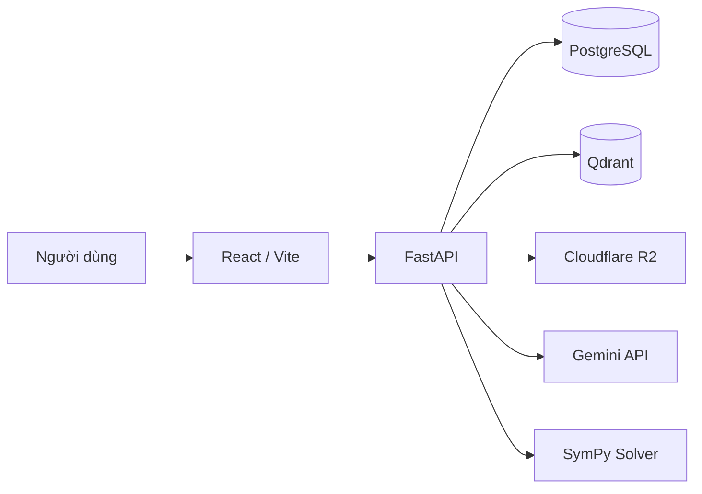
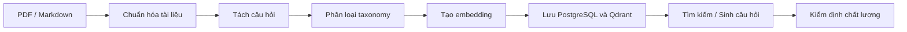

# Math Matching AI

Hệ thống ngân hàng câu hỏi Toán học tích hợp AI, hỗ trợ xử lý tài liệu, phân loại câu hỏi theo lược đồ tri thức, tìm kiếm ngữ nghĩa, sinh câu hỏi trắc nghiệm và kiểm định chất lượng bằng phương pháp neuro-symbolic.

## Tổng quan

Math Matching AI được xây dựng nhằm tự động hóa quá trình tạo và quản lý ngân hàng câu hỏi Toán học từ tài liệu PDF hoặc Markdown.

Hệ thống có khả năng:

* Chuyển đổi và chuẩn hóa tài liệu Toán học.
* Tách câu hỏi và trích xuất công thức.
* Phân loại câu hỏi theo taxonomy Giải tích 1.
* Tạo embedding và tìm kiếm câu hỏi tương tự.
* Sinh câu hỏi trắc nghiệm từ câu hỏi nguồn.
* Kiểm định cấu trúc, đáp án và phương án nhiễu.
* Xác minh một số dạng bài bằng SymPy.

## Tính năng chính

### Xử lý tài liệu

* Upload tài liệu PDF và Markdown.
* Chuyển PDF sang Markdown bằng Gemini.
* Chuẩn hóa nội dung và lưu trữ tài liệu.
* Tách câu hỏi, lời giải, đáp án và công thức.

### AI Matching và tìm kiếm

* Phân loại câu hỏi theo chương, chủ đề và dạng bài.
* Tạo embedding cho nội dung và công thức.
* Tìm kiếm ngữ nghĩa bằng Qdrant.
* Tìm kiếm theo taxonomy, độ khó và loại câu hỏi.

### Sinh câu hỏi trắc nghiệm

* Chuyển câu hỏi tự luận sang trắc nghiệm.
* Sinh biến thể câu hỏi bằng Gemini.
* Sinh câu hỏi bằng symbolic solver.
* Kiểm tra đáp án và phương án nhiễu trước khi lưu.

### Kiểm định chất lượng

* Kiểm tra đủ bốn lựa chọn A, B, C, D.
* Bảo đảm chỉ có một đáp án đúng.
* Phát hiện phương án trùng lặp.
* Xác minh đáp án bằng symbolic solver khi hỗ trợ.
* Phát hiện câu hỏi trùng về mặt ngữ nghĩa.

## Kiến trúc hệ thống



Luồng xử lý chính:



## Công nghệ sử dụng

### Backend

* Python 3.12
* FastAPI
* SQLAlchemy Async
* Pydantic
* PostgreSQL
* Uvicorn

### Frontend

* React
* Vite
* Tailwind CSS
* KaTeX

### AI và xử lý Toán học

* Google Gemini
* Gemini Embedding
* Qdrant
* SymPy

### Hạ tầng

* Docker
* Docker Compose
* Nginx
* Cloudflare R2

## Cấu trúc thư mục

```text
math-matching-ai/
├── apps/
│   ├── api/                 # FastAPI backend
│   └── frontend/            # React/Vite frontend
├── core/
│   ├── config/              # Cấu hình hệ thống
│   └── taxonomy/            # Taxonomy Giải tích 1
├── infra/
│   ├── db/                  # PostgreSQL
│   ├── storage/             # Cloudflare R2
│   └── vector_db/           # Qdrant
├── modules/
│   ├── embeddings/
│   ├── ingestion/
│   ├── neuro_symbolic/
│   ├── question_classification/
│   ├── question_generation/
│   ├── question_quality/
│   ├── question_segmenter/
│   ├── question_storage/
│   ├── semantic_search/
│   └── taxonomy/
├── scripts/
├── tests/
├── docker-compose.yml
├── requirements.txt
└── README.md
```

## Cài đặt

### 1. Clone repository

```bash
git clone git@github.com:ShNam12/math-matching-ai.git
cd math-matching-ai
```

### 2. Tạo file cấu hình

```bash
cp .env.example .env
```

Trên Windows:

```powershell
copy .env.example .env
```

Cập nhật các thông tin cần thiết trong `.env`, bao gồm:

* Gemini API key
* PostgreSQL
* Qdrant
* Cloudflare R2

### 3. Khởi chạy bằng Docker

```bash
docker compose up --build
```

Các dịch vụ mặc định:

| Dịch vụ     | Địa chỉ                      |
| ----------- | ---------------------------- |
| Frontend    | `http://localhost:8080`      |
| Backend API | `http://localhost:8000`      |
| Swagger UI  | `http://localhost:8000/docs` |
| Qdrant      | `http://localhost:6333`      |

Dừng hệ thống:

```bash
docker compose down
```

## Chạy trong môi trường phát triển

### Backend

```bash
python -m venv .venv
```

Windows:

```powershell
.venv\Scripts\activate
pip install -r requirements.txt
uvicorn apps.api.main:app --reload
```

Linux hoặc macOS:

```bash
source .venv/bin/activate
pip install -r requirements.txt
uvicorn apps.api.main:app --reload
```

### Frontend

```bash
cd apps/frontend
npm install
npm run dev
```

Frontend development chạy tại:

```text
http://localhost:5173
```

## Kiểm thử

Chạy toàn bộ backend test:

```bash
python -m pytest -q
```

Kiểm tra frontend:

```bash
cd apps/frontend
npm run lint
npm run build
```

Đánh giá chất lượng tập câu hỏi trắc nghiệm:

```bash
python scripts/evaluate_mcq_quality.py --pretty
```

## API Documentation

FastAPI tự động cung cấp tài liệu API tại:

```text
http://localhost:8000/docs
```

Các nhóm API chính:

* Documents
* Questions
* Semantic Search
* Formula Search
* Taxonomy
* Question Generation
* Quality Validation
* Analytics

## Phạm vi hiện tại

Hệ thống hiện tập trung vào các câu hỏi thuộc học phần Giải tích 1. Symbolic solver mới hỗ trợ một số dạng đạo hàm, tích phân và giới hạn đã được định nghĩa trước.

Các kết quả do mô hình AI sinh ra cần được kiểm định trước khi đưa vào ngân hàng câu hỏi chính thức.

## Tác giả

**Sái Hoài Nam**

Sinh viên Khoa Toán – Tin, Đại học Bách khoa Hà Nội.
